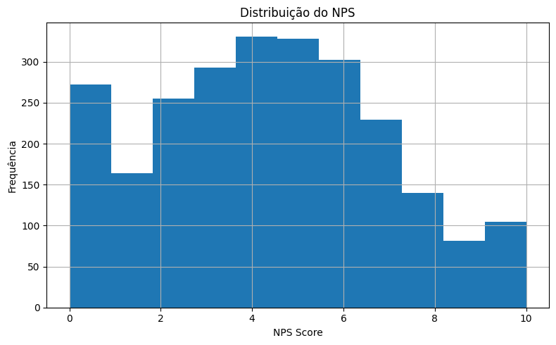
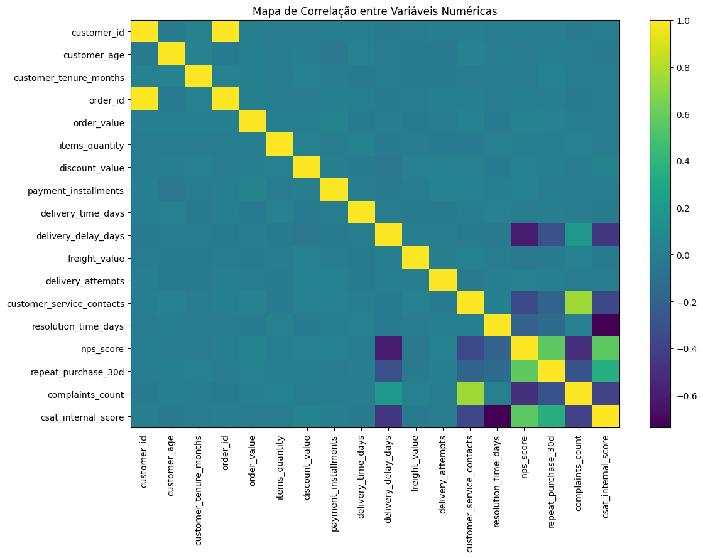
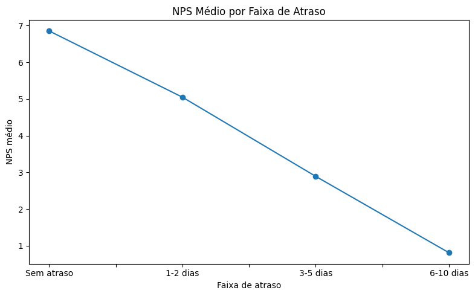

# 📊 Tech Challenge - NPS Preditivo

## 🚀 Visão Executiva

Este projeto analisa os principais fatores que impactam a satisfação do
cliente (NPS) em um e-commerce e propõe uma abordagem preditiva para
antecipar insatisfação antes da coleta da pesquisa.

### 🎯 Problema

Apesar de indicadores operacionais semelhantes, clientes apresentam
níveis muito diferentes de satisfação.

> Como identificar, antecipadamente, quais clientes terão uma
> experiência negativa?

------------------------------------------------------------------------

## 📊 Principais Insights

-   🚨 Atraso na entrega é o principal driver de insatisfação
-   📉 Múltiplos contatos com suporte reduzem o NPS
-   ⚠️ Reclamações são forte indicador de detratores
-   💣 Atraso + suporte → queda acentuada no NPS

------------------------------------------------------------------------

## 📈 Impacto no Negócio

-   Redução de churn
-   Aumento de recompra
-   Melhoria da experiência
-   Crescimento via boca a boca

------------------------------------------------------------------------

## 📂 Estrutura do Projeto

    tech-challenge-nps/
    ├── data/
    ├── notebooks/
    ├── reports/
    │   └── figures/
    ├── models/
    ├── README.md
    └── requirements.txt

------------------------------------------------------------------------

## 📊 Visualizações

------------------------------------------------------------------------

## 🧠 Metodologia

1.  Entendimento do problema
2.  Definição da target
3.  EDA
4.  Insights
5.  Modelo preditivo

------------------------------------------------------------------------

## 🤖 Modelo Preditivo

Classificação: - Promotor (9--10) - Neutro (7--8) - Detrator (0--6)

Modelo: Random Forest

------------------------------------------------------------------------

## 💡 Recomendações

-   🚚 Reduzir atrasos
-   📞 Melhorar atendimento
-   ⚡ Reduzir tempo de resolução
-   🧠 Criar alertas preditivos

------------------------------------------------------------------------

## ⚠️ Limitações

-   NPS é reativo
-   Correlação ≠ causalidade
-   Sem dados qualitativos

------------------------------------------------------------------------

## 🚀 Como Executar

    git clone https://github.com/EdsonDoro/TechChallenge-Fase1.git
    cd TechChallenge-Fase1
    pip install -r requirements.txt
    jupyter notebook

------------------------------------------------------------------------

## 👤 Autor

Alessandra M. Capecce
Alessandro P. dos Santos 
Edson L. Doro
